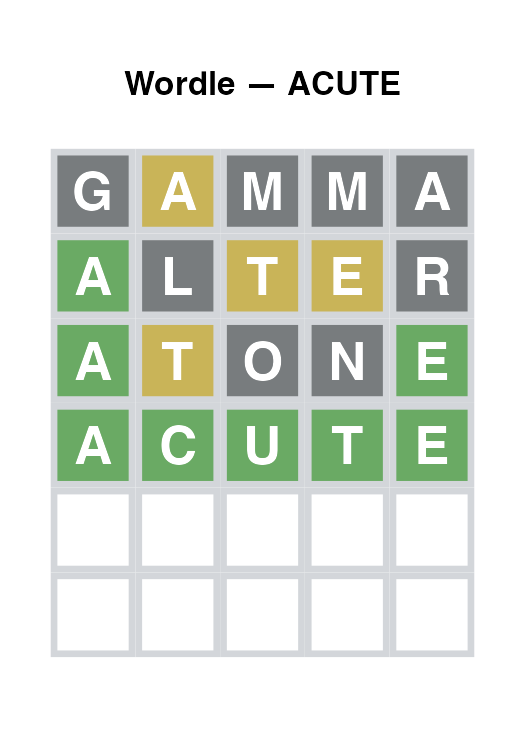
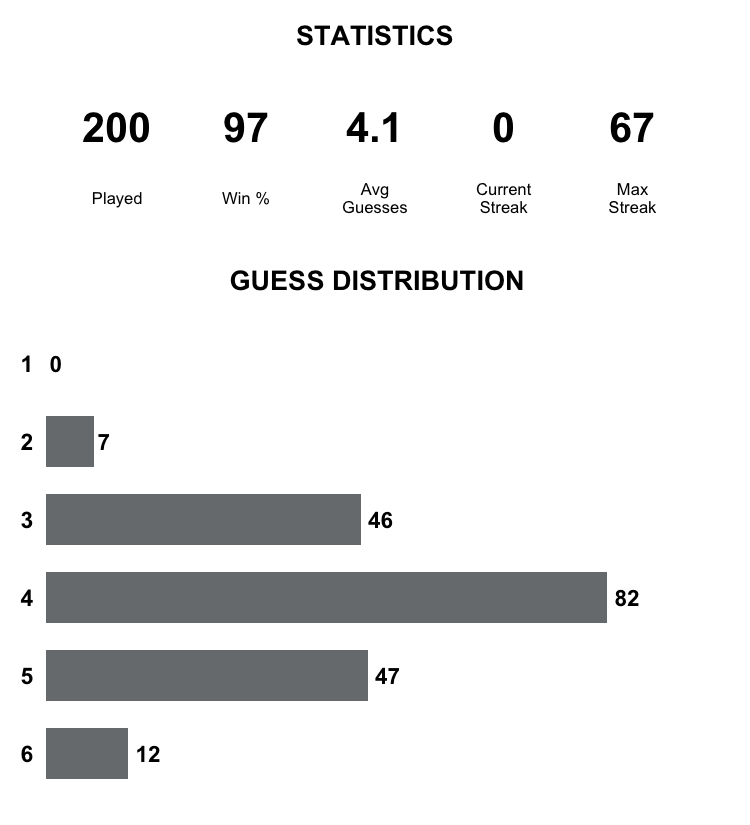

# Wordle Model

A probabilistic model that plays Wordle in R. The model maintains a set of
candidate words that shrinks with each guess, sampling its next guess uniformly
from whatever words remain consistent with the feedback received so far.

## How it works

The model represents the word corpus as a character matrix — one row per word,
one column per letter position. Each round:

1. **Guess** — a word is sampled from the current candidate matrix. The
   sampling is autoregressive (position by position) but provably equivalent
   to drawing uniformly at random from the remaining candidates.
2. **Feedback** — each guessed letter is classified as green (correct
   position), yellow (in word, wrong position), or grey (not in word). A
   two-pass algorithm with a multiset budget handles duplicate letters
   correctly.
3. **Filter** — rows inconsistent with the feedback are removed from the
   matrix. This is exact Bayesian updating under a uniform prior over the
   word corpus.

For a full mathematical derivation see [`model-notes.qmd`](model-notes.qmd)
(requires [Quarto](https://quarto.org) to render).

## Project structure

| File | Purpose |
|------|---------|
| `words.csv` | Wordle word corpus |
| `sample_word.R` | Autoregressive uniform sampler |
| `feedback.R` | Feedback classification and candidate filtering |
| `game.R` | Single-game loop |
| `simulate.R` | Batch simulation runner |
| `analyse.R` | Summary statistics and stats plot |
| `plot_game.R` | Per-game tile grid image |
| `main.R` | Entry point for a single game |
| `model-notes.qmd` | Mathematical notes |

## Getting started

### Prerequisites

```r
install.packages(c("ggplot2", "gridExtra"))
```

Quarto is only needed to render `model-notes.qmd` and is not required to run
the model.

### Play a single game

```r
source("main.R")
```

This picks a random target word, plays up to six guesses, prints each guess
and its feedback to the console, and saves `wordle_result.png` — a tile grid
in the style of the Wordle board.



### Run a simulation

```r
source("simulate.R")
source("analyse.R")

words      <- read.csv("words.csv", stringsAsFactors = FALSE)
words$word <- tolower(words$word)

results <- simulate_games(n = 500, words = words$word)
stats   <- compute_stats(results)
plot_stats(stats)
```

`simulate_games()` returns a tidy data frame with one row per game:

| Column | Type | Description |
|--------|------|-------------|
| `game` | integer | Game index |
| `target` | character | Target word |
| `solved` | logical | Solved within 6 guesses? |
| `n_guesses` | integer | Guesses used (`NA` if unsolved) |

`plot_stats()` saves `wordle_stats.png` — a dashboard showing win rate, average
guesses, streaks, and the guess distribution.


